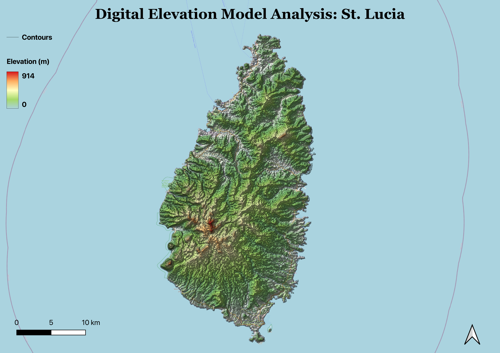
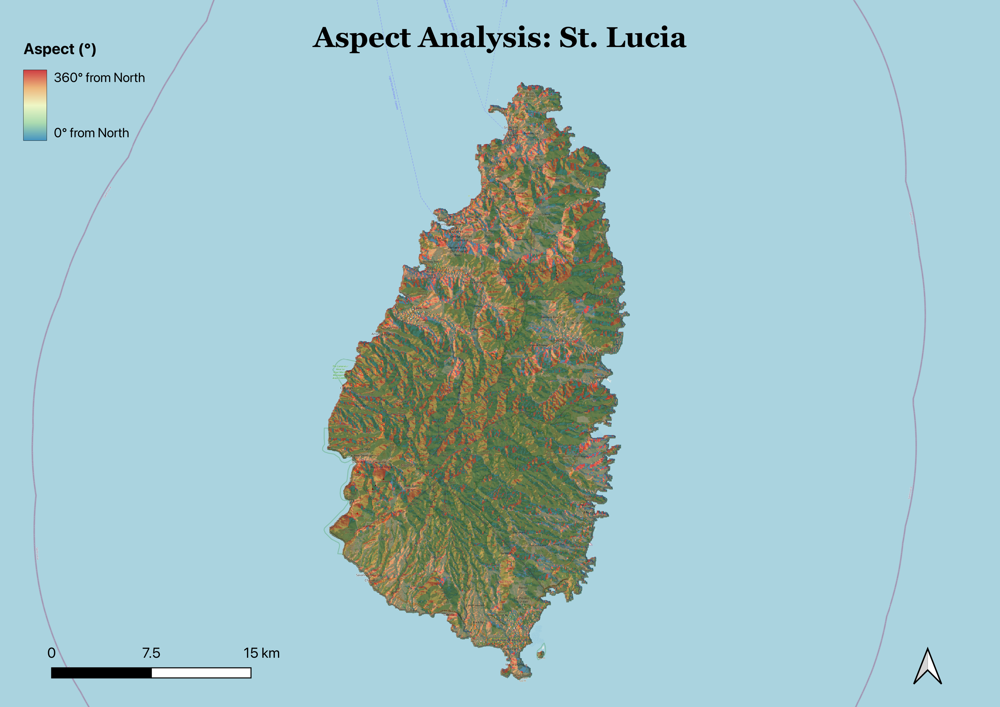
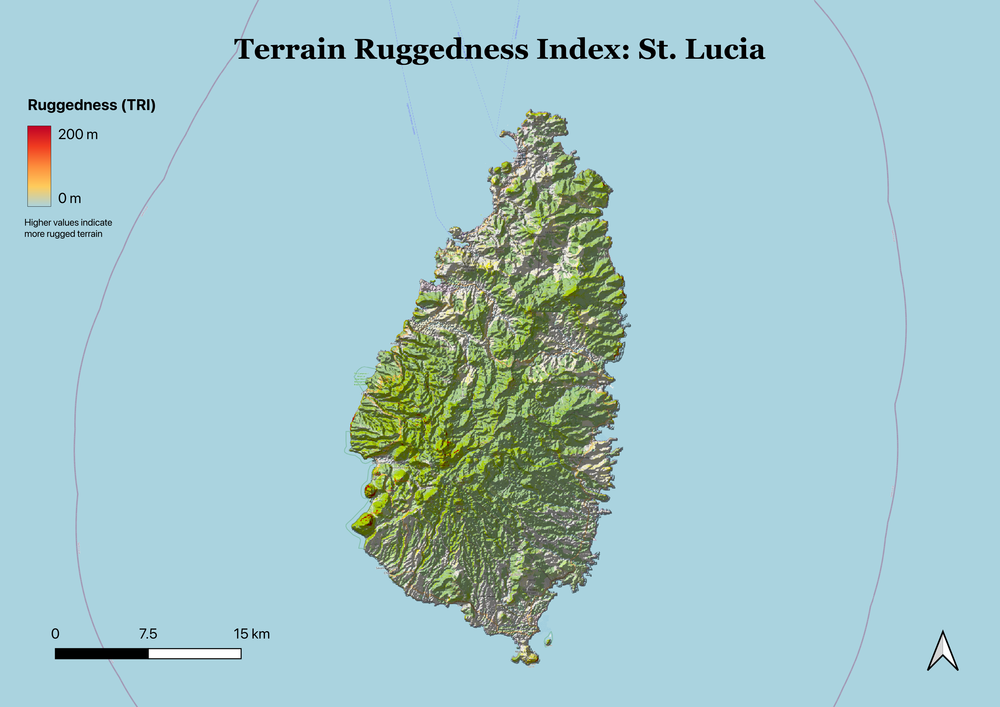

# Terrain Analysis: St. Lucia

Terrain analysis of St. Lucia using a SRTM 30m Digital Elevation Model (DEM) in QGIS.

## Data Source
- SRTM 30m DEM (NASA Shuttle Radar Topography Mission)

## Analysis
Three terrain derivatives were computed and visualized:

**Digital Elevation Model** — Elevation visualized using a green-to-red color ramp draped over a hillshade, revealing St. Lucia's dramatic topography with peak elevations of 914m.

**Aspect** — Slope direction mapped from 0–360° using an inverted Spectral color ramp blended with hillshade via Multiply mode.

**Terrain Ruggedness Index (TRI)** — Surface complexity mapped from 0–200m. High ruggedness values are concentrated near the Pitons volcanic complex in the southwest.

## Maps

## Tools
- QGIS 3.x
- SRTM 30m DEM
